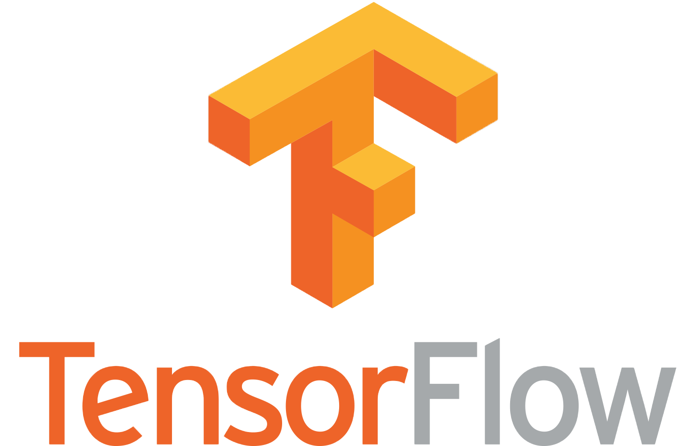

# Welcome to my Github!
I apply machine learning and deep learning tools to extract value from the increasingly data-driven world. With a concrete foundation in scientific research and cultural experiences from 3 continents, I can promise to bring unique perspectives and solutions to arising problems.

Tools and platforms in which I am proficient at:

&nbsp;&nbsp;&nbsp;&nbsp;

&nbsp;&nbsp;&nbsp;&nbsp;
&nbsp;&nbsp;&nbsp;&nbsp;

&nbsp;&nbsp;&nbsp;&nbsp;
&nbsp;&nbsp;&nbsp;&nbsp;
&nbsp;&nbsp;&nbsp;&nbsp;

&nbsp;&nbsp;

For personal and job opportunity inquiries, feel free to reach out through any of the means below:

&nbsp;&nbsp;&nbsp;&nbsp;&nbsp;&nbsp;&nbsp;&nbsp;

&nbsp;&nbsp;&nbsp;&nbsp;&nbsp;&nbsp;&nbsp;&nbsp;

Fun fact: even though I have caffeine intolerance and cannot drink coffee, I am a certified barista!
<!---
hungpham15/hungpham15 is a ✨ special ✨ repository because its `README.md` (this file) appears on your GitHub profile.
You can click the Preview link to take a look at your changes.
--->
